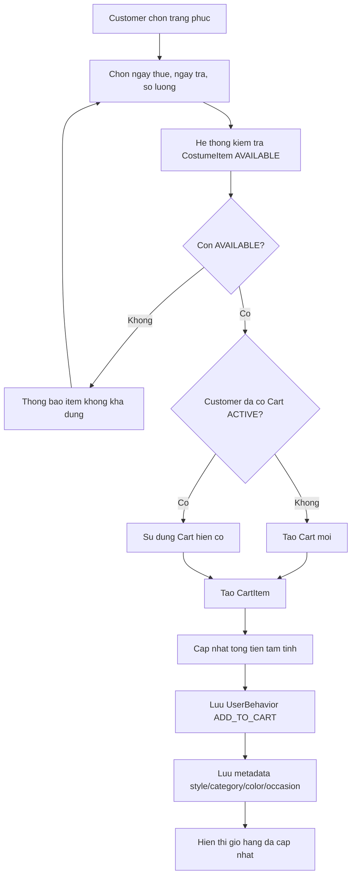

# Use case: Them trang phuc vao gio hang

## Thong tin chung

| Muc | Noi dung |
| --- | --- |
| Ten use case | Them trang phuc vao gio hang |
| Actor chinh | Customer |
| Muc tieu | Cho phep Customer chon trang phuc, ngay thue, ngay tra va so luong de them vao gio hang |
| Database lien quan | Cart, CartItem, CostumeItem, UserBehavior |
| Ket qua thanh cong | Trang phuc duoc them vao gio hang va hanh vi san pham duoc luu de goi y lan sau |

## Dieu kien tien quyet

- Customer da dang nhap.
- Customer da chon mot trang phuc.
- Trang phuc co `CostumeItem` con kha dung voi trang thai `AVAILABLE`.

## Du lieu dau vao

Customer chon cac thong tin:

| Truong | Mo ta |
| --- | --- |
| Trang phuc | Trang phuc muon thue |
| Ngay thue | Ngay bat dau thue |
| Ngay tra | Ngay ket thuc thue |
| So luong | So luong item muon thue |

## Luong chinh

1. Customer chon trang phuc.
2. Customer chon ngay thue.
3. Customer chon ngay tra.
4. Customer chon so luong.
5. He thong kiem tra `CostumeItem` con trang thai `AVAILABLE`.
6. Neu Customer chua co gio hang dang mo, he thong tao moi `Cart`.
7. He thong tao `CartItem` cho trang phuc duoc chon.
8. He thong cap nhat tong tien tam tinh cua `Cart`.
9. He thong luu hanh vi `ADD_TO_CART` vao bang `UserBehavior`.
10. He thong hien thi gio hang da duoc cap nhat.

## Luong thay the

### CostumeItem khong con AVAILABLE

1. He thong kiem tra `CostumeItem`.
2. Neu item khong con `AVAILABLE`, he thong khong tao `CartItem`.
3. He thong thong bao trang phuc/size/mau nay khong con kha dung.
4. Customer co the chon size, mau, ngay thue hoac trang phuc khac.

### Customer da co gio hang

1. He thong kiem tra va tim thay `Cart` dang mo cua Customer.
2. He thong khong tao `Cart` moi.
3. He thong tao hoac cap nhat `CartItem` trong gio hang hien tai.
4. He thong cap nhat tong tien tam tinh.

### Trang phuc da co trong gio hang

1. He thong phat hien trang phuc/item da ton tai trong `CartItem`.
2. He thong cap nhat so luong neu con du item kha dung.
3. He thong cap nhat tong tien tam tinh.

## Du lieu doc tu database

Bang `CostumeItem`:

| Field | Mo ta |
| --- | --- |
| `id` | Ma item trang phuc |
| `costume_id` | Ma trang phuc |
| `size` | Size cua item |
| `color` | Mau sac cua item |
| `status` | Trang thai kha dung, vi du `AVAILABLE`, `RENTED`, `MAINTENANCE` |
| `condition` | Tinh trang hien tai cua item |

Bang `Cart`:

| Field | Mo ta |
| --- | --- |
| `id` | Ma gio hang |
| `user_id` | Customer so huu gio hang |
| `status` | Trang thai gio hang |
| `subtotal` | Tong tien tam tinh |

## Du lieu ghi vao database

Bang `Cart`:

| Field | Gia tri |
| --- | --- |
| `user_id` | ID Customer dang dang nhap |
| `status` | `ACTIVE` |
| `subtotal` | Tong tien tam tinh sau khi them/cap nhat item |
| `updated_at` | Thoi gian cap nhat gio hang |

Bang `CartItem`:

| Field | Gia tri |
| --- | --- |
| `cart_id` | ID gio hang |
| `costume_item_id` | ID item trang phuc duoc chon |
| `rental_start_date` | Ngay thue |
| `rental_end_date` | Ngay tra |
| `quantity` | So luong |
| `unit_price` | Gia thue cua item |
| `deposit_amount` | Tien coc |
| `line_total` | Tong tien tam tinh cua dong item |

Bang `UserBehavior`:

| Field | Gia tri |
| --- | --- |
| `user_id` | ID Customer dang dang nhap |
| `costume_id` | ID trang phuc duoc them vao gio |
| `costume_item_id` | ID item trang phuc duoc chon |
| `behavior_type` | `ADD_TO_CART` |
| `metadata` | Thong tin phuc vu goi y: category, style, color, size, occasion, rental_start_date, rental_end_date, quantity |
| `created_at` | Thoi gian ghi nhan hanh vi |

## Goi y san pham lan dang nhap sau

Khi Customer dang nhap lan sau, he thong co the doc lich su `UserBehavior` de goi y cac san pham cung kieu:

- Uu tien hanh vi co `behavior_type = ADD_TO_CART` vi day la tin hieu y dinh thue manh.
- Lay cac thong tin trong `metadata` nhu `category`, `style`, `color`, `occasion`.
- Tim cac trang phuc tuong tu trong `Costume` va `CostumeItem`.
- Hien thi trong khu vuc goi y nhu `De xuat cho ban`, `Tiep tuc phong cach nay`, hoac `Complete your next rental`.

Vi du:

- Customer them mot mau `gown` mau do cho su kien gala.
- He thong luu `category = Events`, `style = Gala Gown`, `color = Red`, `occasion = Gala`.
- Lan dang nhap sau, he thong uu tien goi y gown, tui cam tay, giay cao got, trang suc hop voi gala/red carpet.

## Hau dieu kien

- Gio hang cua Customer co them trang phuc moi hoac cap nhat so luong.
- Tong tien tam tinh cua gio hang duoc cap nhat.
- Hanh vi `ADD_TO_CART` duoc luu trong `UserBehavior`.
- Du lieu hanh vi san pham san sang de dung cho goi y ca nhan hoa khi Customer dang nhap lan sau.

## So do luong Mermaid

