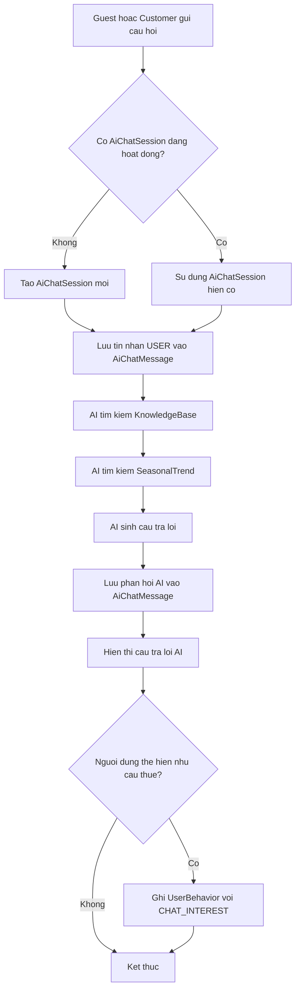

# Use case: Chat voi AI

## Thong tin chung

| Muc | Noi dung |
| --- | --- |
| Ten use case | Chat voi AI |
| Actor chinh | Guest, Customer |
| Muc tieu | Cho phep nguoi dung hoi dap voi AI de duoc tu van trang phuc, phu kien va quy trinh thue |
| Database lien quan | AiChatSession, AiChatMessage, KnowledgeBase, SeasonalTrend, UserBehavior |
| Ket qua thanh cong | He thong luu lich su chat va tra ve cau tra loi AI cho nguoi dung |

## Dieu kien tien quyet

- Nguoi dung truy cap tinh nang chat AI.
- He thong AI dang san sang xu ly cau hoi.
- He thong co du lieu tham khao trong `KnowledgeBase` va/hoac `SeasonalTrend`.

## Luong chinh

1. Guest hoac Customer mo man hinh chat AI.
2. Nguoi dung gui cau hoi.
3. He thong tao moi hoac su dung `AiChatSession` hien co.
4. He thong luu tin nhan cua nguoi dung vao bang `AiChatMessage`.
5. AI tim kiem thong tin lien quan trong:
   - `KnowledgeBase`.
   - `SeasonalTrend`.
6. AI sinh cau tra loi dua tren cau hoi va du lieu tham khao.
7. He thong luu phan hoi cua AI vao bang `AiChatMessage`.
8. He thong hien thi cau tra loi AI cho nguoi dung.
9. Neu nguoi dung the hien nhu cau thue trang phuc, he thong luu hanh vi `CHAT_INTEREST` vao bang `UserBehavior`.

## Luong thay the

### Chua co chat session

1. Nguoi dung gui cau hoi dau tien.
2. He thong khong tim thay `AiChatSession` dang hoat dong.
3. He thong tao `AiChatSession` moi.
4. He thong tiep tuc luong chinh tu buoc luu tin nhan nguoi dung.

### Khong tim thay du lieu tham khao

1. AI tim kiem trong `KnowledgeBase` va `SeasonalTrend`.
2. He thong khong tim thay noi dung lien quan.
3. AI sinh cau tra loi dua tren ngu canh cau hoi va thong tin chung cua he thong.
4. He thong luu va hien thi cau tra loi AI.

### Loi AI hoac loi he thong

1. He thong khong tao duoc cau tra loi AI hoac gap loi xu ly.
2. He thong luu trang thai loi neu can.
3. He thong hien thi thong bao xin thu lai hoac goi y lien he nhan vien ho tro.

## Du lieu doc tu database

Bang `AiChatSession`:

| Field | Mo ta |
| --- | --- |
| `id` | Ma phien chat |
| `user_id` | ID Customer neu nguoi dung da dang nhap |
| `guest_token` | Dinh danh tam thoi cho Guest neu co |
| `status` | Trang thai phien chat |

Bang `KnowledgeBase`:

| Field | Mo ta |
| --- | --- |
| `id` | Ma noi dung kien thuc |
| `title` | Tieu de noi dung |
| `content` | Noi dung tham khao |
| `topic` | Chu de kien thuc |
| `status` | Trang thai kich hoat |

Bang `SeasonalTrend`:

| Field | Mo ta |
| --- | --- |
| `id` | Ma xu huong |
| `season` | Mua hoac thoi diem ap dung |
| `trend_name` | Ten xu huong |
| `description` | Mo ta xu huong |
| `status` | Trang thai kich hoat |

## Du lieu ghi vao database

Bang `AiChatSession`:

| Field | Gia tri |
| --- | --- |
| `user_id` | ID Customer neu da dang nhap |
| `guest_token` | Dinh danh Guest neu chua dang nhap |
| `status` | `ACTIVE` |
| `created_at` | Thoi gian tao phien |

Bang `AiChatMessage`:

| Field | Gia tri |
| --- | --- |
| `session_id` | ID phien chat |
| `sender` | `USER` hoac `AI` |
| `message` | Noi dung tin nhan |
| `created_at` | Thoi gian gui tin nhan |

Bang `UserBehavior` chi ghi khi he thong phat hien nhu cau thue:

| Field | Gia tri |
| --- | --- |
| `user_id` | ID Customer neu da dang nhap |
| `guest_token` | Dinh danh Guest neu chua dang nhap |
| `behavior_type` | `CHAT_INTEREST` |
| `metadata` | Cau hoi, chu de, trang phuc hoac nhu cau duoc phat hien |
| `created_at` | Thoi gian ghi nhan hanh vi |

## Hau dieu kien

- Tin nhan cua nguoi dung duoc luu vao `AiChatMessage`.
- Phan hoi cua AI duoc luu vao `AiChatMessage`.
- Phien chat duoc tao moi hoac tiep tuc trong `AiChatSession`.
- Neu co y dinh thue, hanh vi `CHAT_INTEREST` duoc ghi nhan trong `UserBehavior`.

## So do luong Mermaid

