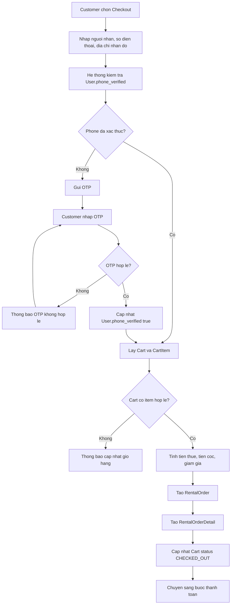

# Use case: Checkout va tao don thue

## Thong tin chung

| Muc | Noi dung |
| --- | --- |
| Ten use case | Checkout va tao don thue |
| Actor chinh | Customer |
| Muc tieu | Cho phep Customer xac nhan thong tin nhan do, xac thuc so dien thoai neu can va tao don thue tu gio hang |
| Database lien quan | User, Cart, CartItem, RentalOrder, RentalOrderDetail |
| Ket qua thanh cong | Don thue moi duoc tao va gio hang chuyen sang trang thai `CHECKED_OUT` |

## Dieu kien tien quyet

- Customer da dang nhap.
- Customer co `Cart` dang hoat dong.
- `Cart` co it nhat mot `CartItem`.
- Cac `CartItem` van hop le tai thoi diem checkout.

## Du lieu dau vao

Customer nhap cac thong tin:

| Truong | Mo ta |
| --- | --- |
| Nguoi nhan | Ten nguoi nhan trang phuc |
| So dien thoai | So dien thoai lien he khi giao/nhan do |
| Dia chi nhan do | Dia chi giao trang phuc |

## Luong chinh

1. Customer chon chuc nang `Checkout`.
2. He thong hien thi man hinh nhap thong tin nhan do.
3. Customer nhap `Nguoi nhan`, `So dien thoai`, `Dia chi nhan do`.
4. He thong kiem tra trang thai `phone_verified` cua Customer trong bang `User`.
5. Neu so dien thoai da duoc xac thuc, he thong tiep tuc checkout.
6. He thong lay du lieu gio hang tu `Cart` va `CartItem`.
7. He thong tinh:
   - Tien thue.
   - Tien coc.
   - Giam gia.
   - Tong tien can thanh toan.
8. He thong tao ban ghi `RentalOrder`.
9. He thong tao cac ban ghi `RentalOrderDetail` tu tung `CartItem`.
10. He thong chuyen trang thai `Cart` sang `CHECKED_OUT`.
11. He thong hien thi don thue da duoc tao va chuyen sang buoc thanh toan neu co.

## Luong thay the

### So dien thoai chua xac thuc

1. He thong kiem tra `User.phone_verified = false`.
2. He thong yeu cau Customer xac thuc OTP.
3. He thong gui ma OTP den so dien thoai Customer da nhap.
4. Customer nhap ma OTP.
5. He thong kiem tra OTP.
6. Neu OTP hop le, he thong cap nhat `User.phone_verified = true`.
7. He thong tiep tuc luong checkout tu buoc tinh tien.

### OTP khong hop le

1. Customer nhap ma OTP.
2. He thong kiem tra va phat hien OTP khong hop le hoac het han.
3. He thong thong bao OTP khong hop le.
4. Customer co the nhap lai OTP hoac yeu cau gui lai ma.

### Gio hang trong

1. Customer chon `Checkout`.
2. He thong kiem tra `Cart` va khong co `CartItem`.
3. He thong khong tao `RentalOrder`.
4. He thong thong bao gio hang dang trong.

### CartItem khong con hop le

1. He thong kiem tra lai cac item trong gio hang.
2. Neu co item khong con kha dung, he thong khong tao don thue.
3. He thong thong bao Customer cap nhat gio hang.

## Du lieu doc tu database

Bang `User`:

| Field | Mo ta |
| --- | --- |
| `id` | ID Customer |
| `full_name` | Ho ten Customer |
| `phone` | So dien thoai |
| `phone_verified` | Trang thai xac thuc so dien thoai |

Bang `Cart`:

| Field | Mo ta |
| --- | --- |
| `id` | Ma gio hang |
| `user_id` | Customer so huu gio hang |
| `status` | Trang thai gio hang |
| `subtotal` | Tong tien tam tinh |

Bang `CartItem`:

| Field | Mo ta |
| --- | --- |
| `id` | Ma item trong gio |
| `cart_id` | Ma gio hang |
| `costume_item_id` | Item trang phuc duoc chon |
| `rental_start_date` | Ngay thue |
| `rental_end_date` | Ngay tra |
| `quantity` | So luong |
| `unit_price` | Gia thue |
| `deposit_amount` | Tien coc |
| `line_total` | Tong tien dong item |

## Du lieu ghi vao database

Bang `User` neu can xac thuc OTP:

| Field | Gia tri |
| --- | --- |
| `phone_verified` | `true` |
| `updated_at` | Thoi gian xac thuc thanh cong |

Bang `RentalOrder`:

| Field | Gia tri |
| --- | --- |
| `user_id` | ID Customer |
| `recipient_name` | Nguoi nhan |
| `recipient_phone` | So dien thoai nhan do |
| `delivery_address` | Dia chi nhan do |
| `rental_amount` | Tien thue |
| `deposit_amount` | Tien coc |
| `discount_amount` | Giam gia |
| `total_amount` | Tong tien can thanh toan |
| `status` | Trang thai don thue ban dau, vi du `PENDING_PAYMENT` |
| `created_at` | Thoi gian tao don |

Bang `RentalOrderDetail`:

| Field | Gia tri |
| --- | --- |
| `rental_order_id` | ID don thue |
| `costume_item_id` | ID item trang phuc |
| `rental_start_date` | Ngay thue |
| `rental_end_date` | Ngay tra |
| `quantity` | So luong |
| `unit_price` | Gia thue |
| `deposit_amount` | Tien coc |
| `line_total` | Tong tien chi tiet |

Bang `Cart`:

| Field | Gia tri |
| --- | --- |
| `status` | `CHECKED_OUT` |
| `updated_at` | Thoi gian checkout |

## Quy tac tinh tien

- `Tien thue` duoc tinh tu gia thue cua tung `CartItem`, so ngay thue va so luong.
- `Tien coc` la tong tien coc cua cac item trong gio.
- `Giam gia` duoc tinh theo ma giam gia, combo nhieu mon, uu dai su kien hoac quy dinh cua he thong.
- `Tong tien can thanh toan = Tien thue + Tien coc - Giam gia`.

## Hau dieu kien

- `RentalOrder` moi duoc tao.
- Moi `CartItem` duoc chuyen thanh `RentalOrderDetail`.
- `Cart.status = CHECKED_OUT`.
- Neu so dien thoai chua xac thuc, `User.phone_verified = true` sau khi OTP thanh cong.
- Customer co the tiep tuc sang buoc thanh toan.

## So do luong Mermaid

