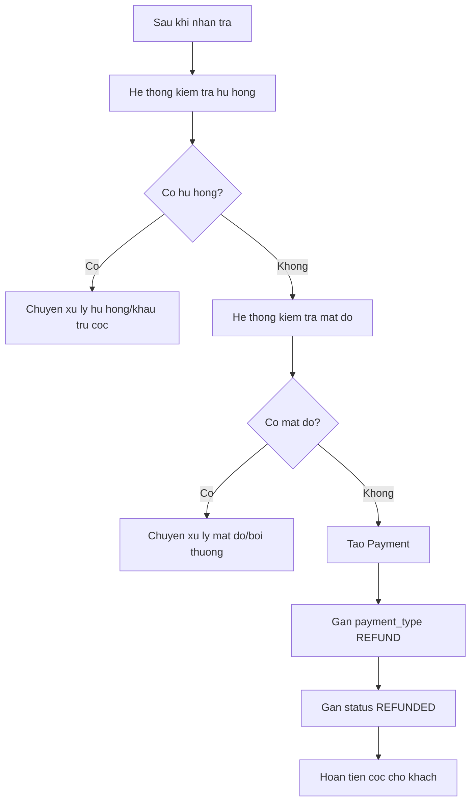

# Use case: Hoan tien coc sau khi nhan tra

## Thong tin chung

| Muc | Noi dung |
| --- | --- |
| Ten use case | Hoan tien coc sau khi nhan tra |
| Actor chinh | Staff |
| Muc tieu | Kiem tra tinh trang sau tra do va hoan tien coc cho khach neu khong co hu hong/mat do |
| Database lien quan | Payment, RentalOrder, RentalOrderDetail |
| Ket qua thanh cong | Tao Payment hoan coc voi `payment_type = REFUND` va `status = REFUNDED` |

## Dieu kien tien quyet

- Don thue da duoc nhan tra.
- `RentalOrder.status = RETURNED`.
- Staff hoac he thong da co ket qua kiem tra tinh trang trang phuc.

## Luong chinh

1. Sau khi nhan tra, he thong kiem tra don thue.
2. He thong kiem tra co hu hong hay khong.
3. He thong kiem tra co mat do hay khong.
4. Neu khong co hu hong va khong co mat do, he thong tao `Payment`.
5. He thong gan `payment_type = REFUND`.
6. He thong gan `status = REFUNDED`.
7. He thong thuc hien hoan tien coc cho khach.
8. He thong luu ket qua hoan tien.

## Luong thay the

### Co hu hong

1. He thong phat hien don thue co item bi hong.
2. He thong khong hoan coc tu dong.
3. Staff thuc hien quy trinh xu ly hu hong/khau tru tien coc.

### Co mat do

1. He thong phat hien don thue co item bi mat.
2. He thong khong hoan coc tu dong.
3. Staff thuc hien quy trinh xu ly mat do/boi thuong.

### Loi hoan tien

1. He thong tao yeu cau hoan tien.
2. Cong thanh toan hoac quy trinh hoan tien bi loi.
3. He thong ghi nhan trang thai loi de Staff xu ly thu cong.

## Du lieu doc tu database

Bang `RentalOrder`:

| Field | Mo ta |
| --- | --- |
| `id` | ID don thue |
| `user_id` | ID Customer |
| `status` | Trang thai don thue |
| `deposit_amount` | Tong tien coc |

Bang `RentalOrderDetail`:

| Field | Mo ta |
| --- | --- |
| `id` | ID chi tiet don thue |
| `rental_order_id` | ID don thue |
| `costume_item_id` | ID item trang phuc |
| `return_status` | Ket qua tra do neu duoc luu o chi tiet |

## Du lieu ghi vao database

Bang `Payment`:

| Field | Gia tri |
| --- | --- |
| `rental_order_id` | ID don thue |
| `user_id` | ID Customer |
| `payment_type` | `REFUND` |
| `amount` | So tien coc duoc hoan |
| `status` | `REFUNDED` |
| `paid_at` | Thoi gian hoan tien thanh cong |
| `note` | Ghi chu hoan coc neu co |

## Hau dieu kien

- Neu don thue hop le, tien coc duoc hoan cho Customer.
- Ban ghi `Payment` duoc tao voi `payment_type = REFUND`.
- `Payment.status = REFUNDED`.
- Neu co hu hong/mat do, he thong khong hoan coc tu dong va chuyen sang xu ly boi thuong.

## So do luong Mermaid

