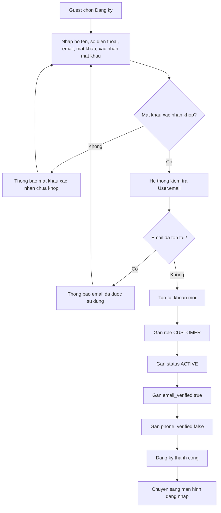

# Use case: Dang ky tai khoan

## Thong tin chung

| Muc | Noi dung |
| --- | --- |
| Ten use case | Dang ky tai khoan |
| Actor chinh | Guest |
| Muc tieu | Tao tai khoan moi cho nguoi dung de co the thue trang phuc |
| Database lien quan | User |
| Ket qua thanh cong | Tai khoan moi duoc tao voi role CUSTOMER va status ACTIVE |

## Dieu kien tien quyet

- Nguoi dung dang o trang web AuraFit.
- Nguoi dung chua dang nhap.
- Email dang ky chua ton tai trong bang `User`.

## Du lieu dau vao

Nguoi dung nhap cac thong tin:

| Truong | Mo ta |
| --- | --- |
| Ho ten | Ten day du cua nguoi dung |
| So dien thoai | So dien thoai lien he cua nguoi dung |
| Email | Email dung de dang nhap va nhan thong bao |
| Mat khau | Mat khau tai khoan |
| Xac nhan mat khau | Gia tri nhap lai de kiem tra mat khau |

## Luong chinh

1. Guest chon chuc nang `Dang ky`.
2. He thong hien thi man hinh dang ky.
3. Guest nhap `Ho ten`, `So dien thoai`, `Email`, `Mat khau`, `Xac nhan mat khau`.
4. Guest gui thong tin dang ky.
5. He thong kiem tra `Mat khau` va `Xac nhan mat khau` co trung nhau hay khong.
6. He thong kiem tra email trong bang `User`.
7. Neu `User.email` chua ton tai, he thong tao tai khoan moi.
8. He thong gan thong tin mac dinh:
   - `role = CUSTOMER`
   - `status = ACTIVE`
   - `email_verified = true`
   - `phone_verified = false`
9. He thong thong bao dang ky thanh cong.
10. He thong chuyen nguoi dung sang man hinh dang nhap.

## Luong thay the

### Email da ton tai

1. He thong kiem tra va phat hien `User.email` da ton tai.
2. He thong khong tao tai khoan moi.
3. He thong hien thi thong bao email da duoc su dung.
4. Guest co the nhap email khac hoac chuyen sang man hinh dang nhap.

### Du lieu khong hop le

1. He thong kiem tra du lieu dau vao.
2. Neu ho ten, so dien thoai, email hoac mat khau khong hop le, he thong hien thi loi tuong ung.
3. Guest chinh sua thong tin va gui lai.

### Mat khau xac nhan khong khop

1. He thong so sanh `Mat khau` va `Xac nhan mat khau`.
2. Neu hai gia tri khong trung nhau, he thong khong tao tai khoan.
3. He thong hien thi thong bao mat khau xac nhan chua khop.
4. Guest nhap lai mat khau va gui lai.

## Du lieu duoc ghi vao database

Bang `User`:

| Field | Gia tri |
| --- | --- |
| `full_name` | Ho ten nguoi dung nhap |
| `phone` | So dien thoai nguoi dung nhap |
| `email` | Email nguoi dung nhap |
| `password` | Mat khau da duoc ma hoa |
| `role` | `CUSTOMER` |
| `status` | `ACTIVE` |
| `email_verified` | `true` |
| `phone_verified` | `false` |

## Hau dieu kien

- Mot ban ghi moi duoc tao trong bang `User`.
- Tai khoan co quyen Customer.
- Nguoi dung duoc chuyen sang man hinh dang nhap.

## So do luong Mermaid

