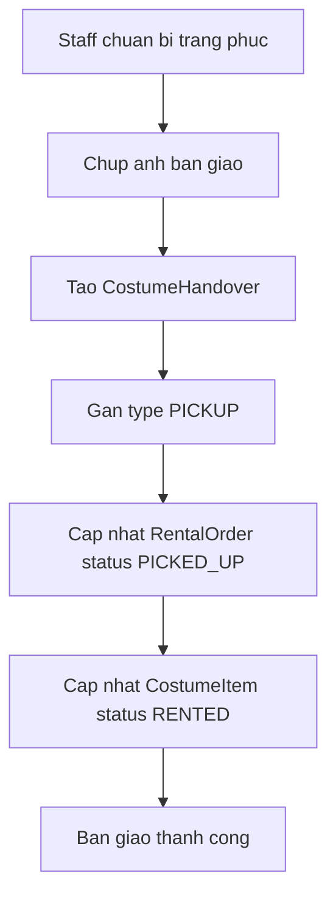

# Use case: Staff ban giao trang phuc

## Thong tin chung

| Muc | Noi dung |
| --- | --- |
| Ten use case | Staff ban giao trang phuc |
| Actor chinh | Staff |
| Muc tieu | Ghi nhan viec ban giao trang phuc cho khach va cap nhat trang thai don thue/item |
| Database lien quan | CostumeHandover, RentalOrder, CostumeItem |
| Ket qua thanh cong | Don thue chuyen sang `PICKED_UP` va item chuyen sang `RENTED` |

## Dieu kien tien quyet

- RentalOrder da duoc xac nhan va san sang ban giao.
- Staff da chuan bi trang phuc.
- CostumeItem van kha dung de ban giao.

## Luong chinh

1. Staff chuan bi trang phuc theo don thue.
2. Staff chup anh ban giao trang phuc.
3. He thong tao `CostumeHandover`.
4. He thong gan `CostumeHandover.type = PICKUP`.
5. He thong luu anh ban giao vao `CostumeHandover`.
6. He thong cap nhat `RentalOrder.status = PICKED_UP`.
7. He thong cap nhat `CostumeItem.status = RENTED`.
8. He thong thong bao ban giao thanh cong.

## Luong thay the

### Khong chup duoc anh ban giao

1. Staff thuc hien ban giao nhung chua co anh.
2. He thong yeu cau Staff tai/chup anh ban giao truoc khi hoan tat.
3. Staff chup lai anh va tiep tuc luong chinh.

### CostumeItem khong kha dung

1. Staff chuan bi trang phuc.
2. He thong phat hien `CostumeItem` khong con kha dung.
3. He thong khong cap nhat don sang `PICKED_UP`.
4. Staff can thay item khac hoac xu ly don thue.

## Du lieu ghi vao database

Bang `CostumeHandover`:

| Field | Gia tri |
| --- | --- |
| `rental_order_id` | ID don thue |
| `staff_id` | ID Staff ban giao |
| `type` | `PICKUP` |
| `handover_images` | Anh ban giao |
| `note` | Ghi chu ban giao neu co |
| `created_at` | Thoi gian ban giao |

Bang `RentalOrder`:

| Field | Gia tri |
| --- | --- |
| `status` | `PICKED_UP` |
| `updated_at` | Thoi gian cap nhat |

Bang `CostumeItem`:

| Field | Gia tri |
| --- | --- |
| `status` | `RENTED` |
| `updated_at` | Thoi gian cap nhat |

## Hau dieu kien

- Ban giao duoc ghi nhan bang `CostumeHandover`.
- Don thue o trang thai `PICKED_UP`.
- Trang phuc/item o trang thai `RENTED`.

## So do luong Mermaid

