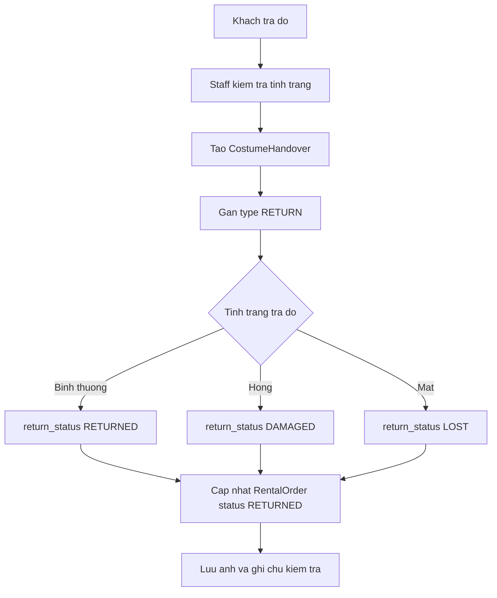

# Use case: Staff nhan tra va kiem tra trang phuc

## Thong tin chung

| Muc | Noi dung |
| --- | --- |
| Ten use case | Staff nhan tra va kiem tra trang phuc |
| Actor chinh | Staff |
| Muc tieu | Ghi nhan khach tra do va danh gia tinh trang trang phuc sau khi thue |
| Database lien quan | CostumeHandover, RentalOrder, RentalOrderDetail, CostumeItem |
| Ket qua thanh cong | He thong ghi nhan ket qua tra do va cap nhat don thue sang `RETURNED` |

## Dieu kien tien quyet

- Don thue da duoc ban giao cho khach.
- `RentalOrder.status = PICKED_UP`.
- Khach mang/tra trang phuc cho Staff.

## Luong chinh

1. Khach tra do cho Staff.
2. Staff kiem tra tinh trang trang phuc.
3. He thong tao `CostumeHandover`.
4. He thong gan `CostumeHandover.type = RETURN`.
5. Staff chon ket qua tra do:
   - Neu binh thuong: `return_status = RETURNED`.
   - Neu hong: `return_status = DAMAGED`.
   - Neu mat: `return_status = LOST`.
6. He thong cap nhat `RentalOrder.status = RETURNED`.
7. He thong luu ghi chu, anh kiem tra va ket qua tra do neu co.

## Luong thay the

### Trang phuc bi hong

1. Staff phat hien trang phuc bi hong.
2. Staff gan `return_status = DAMAGED`.
3. He thong luu muc do hong, hinh anh va ghi chu vao `CostumeHandover`.
4. He thong co the giu `CostumeItem` o trang thai can xu ly/bao tri tuy quy tac nghiep vu.

### Trang phuc bi mat

1. Staff phat hien khach khong tra du trang phuc/item.
2. Staff gan `return_status = LOST`.
3. He thong luu ghi chu mat do vao `CostumeHandover`.
4. He thong co the cap nhat item lien quan sang trang thai mat do tuy quy tac nghiep vu.

## Du lieu doc tu database

Bang `RentalOrder`:

| Field | Mo ta |
| --- | --- |
| `id` | ID don thue |
| `status` | Trang thai don thue |

Bang `RentalOrderDetail`:

| Field | Mo ta |
| --- | --- |
| `id` | ID chi tiet don thue |
| `rental_order_id` | ID don thue |
| `costume_item_id` | ID item da thue |

Bang `CostumeItem`:

| Field | Mo ta |
| --- | --- |
| `id` | ID item trang phuc |
| `status` | Trang thai hien tai |
| `condition` | Tinh trang item |

## Du lieu ghi vao database

Bang `CostumeHandover`:

| Field | Gia tri |
| --- | --- |
| `rental_order_id` | ID don thue |
| `staff_id` | ID Staff nhan tra |
| `type` | `RETURN` |
| `return_status` | `RETURNED`, `DAMAGED`, hoac `LOST` |
| `return_images` | Anh tinh trang khi tra |
| `note` | Ghi chu cua Staff |
| `created_at` | Thoi gian nhan tra |

Bang `RentalOrder`:

| Field | Gia tri |
| --- | --- |
| `status` | `RETURNED` |
| `updated_at` | Thoi gian cap nhat |

## Hau dieu kien

- Ket qua nhan tra duoc ghi trong `CostumeHandover`.
- Don thue duoc cap nhat sang `RETURNED`.
- Thong tin hong/mat do duoc luu de xu ly hoan coc hoac boi thuong.

## So do luong Mermaid

