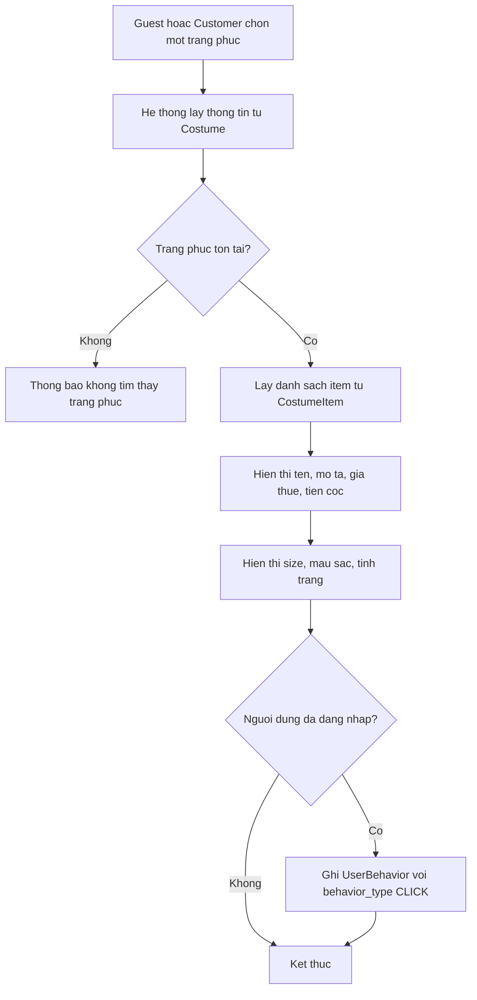

# Use case: Xem chi tiet trang phuc

## Thong tin chung

| Muc | Noi dung |
| --- | --- |
| Ten use case | Xem chi tiet trang phuc |
| Actor chinh | Guest, Customer |
| Muc tieu | Cho phep nguoi dung xem thong tin chi tiet cua mot trang phuc |
| Database lien quan | Costume, CostumeItem, UserBehavior |
| Ket qua thanh cong | He thong hien thi day du thong tin chi tiet trang phuc |

## Dieu kien tien quyet

- Nguoi dung dang o trang danh sach trang phuc hoac mot khu vuc co hien thi trang phuc.
- Trang phuc duoc chon ton tai trong bang `Costume`.
- He thong co du lieu size, mau sac va tinh trang trong bang `CostumeItem`.

## Luong chinh

1. Guest hoac Customer chon mot trang phuc.
2. He thong lay thong tin trang phuc tu bang `Costume`.
3. He thong lay danh sach item/size/mau sac/tinh trang tu bang `CostumeItem`.
4. He thong hien thi man hinh chi tiet trang phuc.
5. Man hinh chi tiet hien thi:
   - Ten trang phuc.
   - Mo ta.
   - Gia thue.
   - Tien coc.
   - Danh sach size.
   - Mau sac.
   - Tinh trang.
6. Neu nguoi dung da dang nhap, he thong luu hanh vi `CLICK` vao bang `UserBehavior`.

## Luong thay the

### Trang phuc khong ton tai

1. He thong khong tim thay trang phuc trong bang `Costume`.
2. He thong hien thi thong bao khong tim thay trang phuc.
3. Nguoi dung co the quay lai trang danh sach trang phuc.

### Trang phuc khong co item kha dung

1. He thong tim thay trang phuc trong `Costume`.
2. He thong khong tim thay `CostumeItem` kha dung.
3. He thong van hien thi thong tin trang phuc, dong thoi thong bao trang phuc hien chua co size/mau kha dung.

### Loi tai du lieu

1. He thong gap loi khi lay du lieu tu `Costume` hoac `CostumeItem`.
2. He thong hien thi thong bao loi tai du lieu.
3. Nguoi dung co the thu tai lai trang.

## Du lieu doc tu database

Bang `Costume`:

| Field | Mo ta |
| --- | --- |
| `id` | Ma trang phuc |
| `name` | Ten trang phuc |
| `description` | Mo ta trang phuc |
| `rental_price` | Gia thue |
| `deposit_amount` | Tien coc |
| `status` | Trang thai trang phuc |

Bang `CostumeItem`:

| Field | Mo ta |
| --- | --- |
| `id` | Ma item trang phuc |
| `costume_id` | Ma trang phuc lien ket |
| `size` | Size cua item |
| `color` | Mau sac cua item |
| `condition` | Tinh trang item |
| `status` | Trang thai kha dung cua item |

## Du lieu ghi vao database

Bang `UserBehavior` chi duoc ghi khi nguoi dung da dang nhap:

| Field | Gia tri |
| --- | --- |
| `user_id` | ID cua Customer dang dang nhap |
| `costume_id` | ID trang phuc duoc click |
| `behavior_type` | `CLICK` |
| `metadata` | Thong tin nguon click neu co, vi du danh sach, trang chu, goi y AI |
| `created_at` | Thoi gian ghi nhan hanh vi |

## Hau dieu kien

- Guest xem duoc chi tiet trang phuc ma khong can dang nhap.
- Customer xem duoc chi tiet trang phuc va hanh vi click duoc ghi nhan.
- Du lieu `CLICK` co the duoc dung cho goi y AI va phan tich san pham.

## So do luong Mermaid

