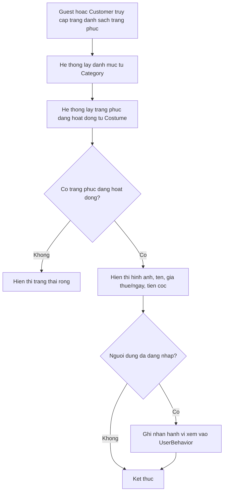

# Use case: Xem danh sach trang phuc

## Thong tin chung

| Muc | Noi dung |
| --- | --- |
| Ten use case | Xem danh sach trang phuc |
| Actor chinh | Guest, Customer |
| Muc tieu | Cho phep nguoi dung xem cac trang phuc dang duoc cho thue |
| Database lien quan | Category, Costume, UserBehavior |
| Ket qua thanh cong | He thong hien thi danh sach trang phuc dang hoat dong theo danh muc |

## Dieu kien tien quyet

- Nguoi dung truy cap website AuraFit.
- He thong co du lieu danh muc trong bang `Category`.
- He thong co du lieu trang phuc dang hoat dong trong bang `Costume`.

## Luong chinh

1. Guest hoac Customer truy cap trang danh sach trang phuc.
2. He thong lay danh sach danh muc tu bang `Category`.
3. He thong lay danh sach trang phuc dang hoat dong tu bang `Costume`.
4. He thong hien thi danh sach trang phuc cho nguoi dung.
5. Moi trang phuc hien thi cac thong tin:
   - Hinh anh.
   - Ten trang phuc.
   - Gia thue/ngay.
   - Tien coc.
6. Neu nguoi dung da dang nhap, he thong ghi nhan hanh vi xem vao bang `UserBehavior`.

## Luong thay the

### Khong co trang phuc dang hoat dong

1. He thong khong tim thay trang phuc co trang thai dang hoat dong.
2. He thong hien thi trang thai rong hoac thong bao chua co trang phuc phu hop.

### Loi tai du lieu

1. He thong khong lay duoc du lieu tu `Category` hoac `Costume`.
2. He thong hien thi thong bao loi tai du lieu.
3. Nguoi dung co the thu tai lai trang.

## Du lieu doc tu database

Bang `Category`:

| Field | Mo ta |
| --- | --- |
| `id` | Ma danh muc |
| `name` | Ten danh muc |
| `status` | Trang thai danh muc |

Bang `Costume`:

| Field | Mo ta |
| --- | --- |
| `id` | Ma trang phuc |
| `category_id` | Danh muc cua trang phuc |
| `name` | Ten trang phuc |
| `image_url` | Hinh anh trang phuc |
| `rental_price_per_day` | Gia thue/ngay |
| `deposit_amount` | Tien coc |
| `status` | Trang thai trang phuc |

## Du lieu ghi vao database

Bang `UserBehavior` chi duoc ghi khi nguoi dung da dang nhap:

| Field | Gia tri |
| --- | --- |
| `user_id` | ID cua Customer dang dang nhap |
| `behavior_type` | `VIEW_COSTUME_LIST` |
| `metadata` | Thong tin danh muc, bo loc hoac trang hien tai neu co |
| `created_at` | Thoi gian ghi nhan hanh vi |

## Hau dieu kien

- Guest xem duoc danh sach trang phuc ma khong can dang nhap.
- Customer xem duoc danh sach trang phuc va hanh vi xem duoc ghi nhan.
- Du lieu hanh vi co the duoc dung cho goi y AI sau nay.

## So do luong Mermaid

